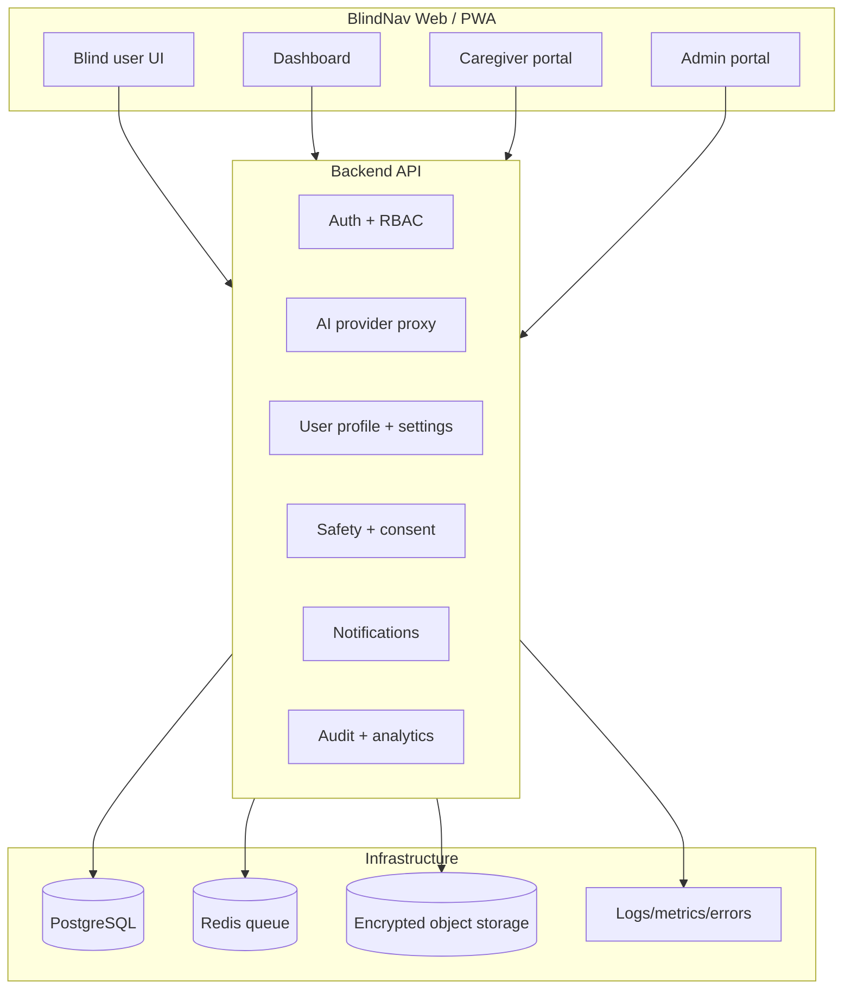

# BlindNav Audit

## Executive Summary

The current workspace contains a polished single-page static prototype built with plain HTML, CSS, and JavaScript. It is a strong concept demo, but it is not yet a production-ready assistive platform. The prototype proves the interaction model, but it does not provide authentication, role-based access, secure backend processing, PWA installability, offline behavior, caregiver workflows, admin tooling, audit logging, or safety controls.

### Architecture decision

The current prototype should be **converted to React + TypeScript + Vite**, not only progressively refactored in place.

Reasoning:

- The product now needs multiple role-based experiences, shared UI state, reusable components, route guards, forms, settings, dialogs, and dashboard views.
- A plain DOM script is fine for a prototype, but it becomes fragile once you add account management, admin tables, onboarding, notification flows, and persistent settings.
- Vite keeps the client fast and simple for a mobile-first PWA.
- TypeScript is important for safety-critical flows, prompt configuration, backend contracts, and accessibility state.
- The backend should be separated from the frontend and own secrets, AI provider access, notifications, logging, and persistence.

Recommended stack:

- Frontend: React + TypeScript + Vite + PWA plugin
- Routing/UI state: React Router, typed query/state helpers, minimal global state
- Backend: NestJS or Fastify-based Node service with strong validation and modular boundaries
- Database: PostgreSQL
- Jobs/queues: Redis-backed queue worker
- ORM: Prisma or Drizzle with strict migrations
- Auth: secure session or token-based auth with MFA support for admins
- Storage: encrypted object storage for temporary uploads
- Observability: structured logs, error tracking, audit logs, metrics

## What Currently Exists

- A single-page demo called Blind Nav Web.
- A hero section with a mode selector and Gemini API key input.
- A live camera panel using `getUserMedia`.
- A basic speech-recognition control.
- Text-to-speech output for responses.
- A prompt input for assistant mode.
- An image upload input and a demo image for reading mode.
- A client-side Gemini request path.
- A polished visual layer with responsive layout and focus states.

## What Works

- The page renders correctly on localhost.
- Camera access works in a browser on a secure local origin.
- Browser speech synthesis works as a fallback interaction channel.
- The demo reading flow returns a usable response.
- The app is responsive and visually coherent.
- The prototype demonstrates the three key interaction modes from the Android app.

## What Is Missing

- User accounts and authentication.
- Role-based access control for blind users, caregivers, and administrators.
- Persistent preferences for language, voice, speech speed, instruction detail, vibration, privacy, and trusted contacts.
- Trusted-contact workflows.
- Emergency/assistance flows.
- Proper backend AI proxying and secret handling.
- Prompt versioning and provider abstraction.
- Safe uncertainty handling for navigation and scene analysis.
- Accessibility-first onboarding and keyboard-only test coverage.
- PWA manifest, service worker, offline shell, update notices, and installability.
- Local persistence for settings, saved places, reading history, and recent journeys.
- Admin dashboard, incident review, support tickets, analytics, and configuration management.
- Data export and account deletion.
- Permission education and recovery flows for camera, microphone, and location.

## What Should Be Retained

- The core three-mode product concept.
- The voice-first interaction model.
- The camera-driven scene analysis idea.
- The reading mode workflow.
- The general low-friction structure of quick actions and large controls.
- The current visual direction as a temporary prototype reference, but not as the final production system.

## What Should Be Rewritten

- The entire client-side implementation should move from raw DOM scripting to component-based React.
- Gemini calls should move to the backend.
- The client should not hold provider secrets or privileged configuration.
- Navigation, assistant, reading, and emergency flows should each have dedicated prompts, safety policies, and UI states.
- The current page should be split into reusable screen components and shared accessibility primitives.
- All ephemeral camera/image handling should be isolated behind explicit consent and retention policy controls.

## Security Risks

- Client-side API key entry is acceptable for a demo only; it must not be the production architecture.
- Direct browser-to-provider calls expose operational details and complicate redaction, retries, rate limiting, and safety policy enforcement.
- Uploaded or captured images may contain highly sensitive personal data.
- Emergency and trusted-contact features can be misused without strict consent and scope controls.
- Admin functions require stronger auth, MFA, audit trails, and privilege separation.
- Any location-sharing feature must be opt-in, temporary, and clearly bounded.

## Accessibility Risks

- The current prototype does not yet provide full screen-reader and keyboard flows for all states.
- Speech recognition can fail silently or behave inconsistently across browsers.
- Mode changes are visually clear but need better announcement and focus management.
- The interface needs richer accessible forms for settings, permissions, and confirmations.
- PWA install and offline states must be announced clearly.
- The app needs safe reduced-motion behavior and larger touch target checks.

## Navigation Safety Risks

- Camera-based scene analysis must never be presented as reliable route navigation.
- Single-frame AI output can miss moving hazards, drops, vehicles, or layout changes.
- The app must prioritize uncertainty, ask users to stop and check surroundings, and recommend a cane, guide dog, or human assistance when visibility is poor.
- Step-by-step GPS navigation and obstacle awareness should remain separate concepts.
- The system must avoid overconfident path or distance claims when technical confidence is weak.

## User Problems To Solve

- Indoor and outdoor orientation.
- Detecting obstacles and hazards.
- Finding doors, stairs, crossings, and entrances.
- Reading signs, menus, labels, and documents.
- Asking questions about the environment.
- Operating without sight, often with one hand, in noisy or low-connectivity conditions.
- Rapidly pausing guidance when the user is uncertain.
- Requesting assistance with low friction.
- Managing privacy-sensitive camera, location, and audio data.

## Reusable Logic and Ideas From the Android App

- The Android app already models navigation, assistant, and reading modes.
- It contains useful prompt direction for the three AI personas.
- It demonstrates TTS-driven feedback and live camera analysis intent.
- It shows the importance of quick mode switching and a simple control surface.
- It also reveals technical debt: client-side API key placeholders, mixed concerns, duplicated Gemini files, and safety logic embedded in UI code.

## Recommended Architecture

## Data Model Direction

- Users and authentication sessions.
- Roles and permissions.
- Accessibility preferences.
- Trusted contacts and consent grants.
- Saved places and recent journeys.
- Reading history and extracted text records.
- Assistance requests and emergency alerts.
- AI request logs with redaction.
- Prompt versions and provider configuration.
- Incidents, reports, support tickets, and audit logs.

## Prioritized Risks To Address First

1. Move AI and secrets to the backend.
2. Introduce account and role-based access control.
3. Add explicit consent, retention, and deletion rules for camera and location data.
4. Separate navigation guidance from hazard description and emergency flows.
5. Build accessibility settings persistence and safe onboarding.
6. Add installable PWA behavior and offline-safe fallbacks.
7. Build caregiver and admin workflows.

## Immediate Prototype Improvements

- Replace the client-side Gemini key field with a backend-backed configuration path.
- Add a real settings screen for language, speech rate, and instruction detail.
- Add a visible skip link and better focus management.
- Add permission explanations before camera and microphone prompts.
- Add a network and low-connectivity status banner.
- Add safe uncertainty phrases and a pause/stop control that is always available.
- Split output by mode more clearly and announce mode changes.
- Store preferences locally with an explicit privacy notice.

## Conclusion

The prototype validates the concept, but the product needs a component-based frontend and a secure backend architecture to become a real assistive platform. The right next step is a React + TypeScript + Vite migration with a separate Node backend and a PostgreSQL data model.